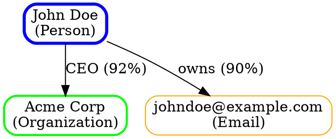

# Export Formats v2.0

Export specifications for OSINT investigation data.

---

## 1. JSON Export Schema

### Purpose
Structured, machine-readable format for data exchange and integration.

### Schema Definition
```json
{
  "$schema": "http://json-schema.org/draft-07/schema#",
  "title": "OSINT Investigation Export",
  "type": "object",
  "required": ["metadata", "investigation"],
  "properties": {
    "metadata": {
      "type": "object",
      "required": ["version", "export_date", "case_id"],
      "properties": {
        "version": {
          "type": "string",
          "description": "Export format version",
          "example": "2.0"
        },
        "export_date": {
          "type": "string",
          "format": "date-time",
          "description": "ISO 8601 timestamp of export"
        },
        "case_id": {
          "type": "string",
          "description": "Unique investigation identifier"
        },
        "case_name": {
          "type": "string",
          "description": "Human-readable case name"
        },
        "classification": {
          "type": "string",
          "enum": ["PUBLIC", "INTERNAL", "CONFIDENTIAL", "RESTRICTED", "SECRET"]
        },
        "exported_by": {
          "type": "string",
          "description": "Analyst who generated export"
        },
        "tool": {
          "type": "string",
          "description": "Tool used for export",
          "example": "OSINT-Investigator-v2.0"
        }
      }
    },
    "investigation": {
      "type": "object",
      "properties": {
        "entities": {
          "type": "array",
          "items": {
            "$ref": "#/definitions/entity"
          }
        },
        "sources": {
          "type": "array",
          "items": {
            "$ref": "#/definitions/source"
          }
        },
        "findings": {
          "type": "array",
          "items": {
            "$ref": "#/definitions/finding"
          }
        },
        "connections": {
          "type": "array",
          "items": {
            "$ref": "#/definitions/connection"
          }
        },
        "timeline": {
          "type": "array",
          "items": {
            "$ref": "#/definitions/timeline_event"
          }
        }
      }
    }
  },
  "definitions": {
    "entity": {
      "type": "object",
      "required": ["id", "type", "name"],
      "properties": {
        "id": {
          "type": "string",
          "description": "Unique entity identifier"
        },
        "type": {
          "type": "string",
          "enum": ["person", "organization", "domain", "ip_address", "location", "device", "email", "phone", "social_media", "document", "other"]
        },
        "name": {
          "type": "string"
        },
        "aliases": {
          "type": "array",
          "items": { "type": "string" }
        },
        "description": {
          "type": "string"
        },
        "confidence": {
          "type": "number",
          "minimum": 0,
          "maximum": 100,
          "description": "Confidence percentage"
        },
        "attributes": {
          "type": "object",
          "description": "Entity-specific attributes"
        },
        "sources": {
          "type": "array",
          "items": { "type": "string" },
          "description": "Source IDs"
        },
        "created_at": {
          "type": "string",
          "format": "date-time"
        },
        "updated_at": {
          "type": "string",
          "format": "date-time"
        },
        "tags": {
          "type": "array",
          "items": { "type": "string" }
        }
      }
    },
    "source": {
      "type": "object",
      "required": ["id", "type", "url"],
      "properties": {
        "id": {
          "type": "string"
        },
        "type": {
          "type": "string",
          "enum": ["social_media", "public_record", "news", "database", "website", "leak", "forum", "academic", "corporate", "government", "other"]
        },
        "name": {
          "type": "string",
          "description": "Human-readable source name"
        },
        "url": {
          "type": "string",
          "format": "uri"
        },
        "archive_url": {
          "type": "string",
          "format": "uri",
          "description": "Wayback Machine or similar archive link"
        },
        "accessed_at": {
          "type": "string",
          "format": "date-time"
        },
        "published_at": {
          "type": "string",
          "format": "date-time"
        },
        "reliability": {
          "type": "string",
          "enum": ["A", "B", "C", "D", "E", "F"],
          "description": "Source reliability grading"
        },
        "credibility": {
          "type": "number",
          "minimum": 0,
          "maximum": 100
        },
        "content_hash": {
          "type": "string",
          "description": "SHA-256 hash of content"
        },
        "raw_content": {
          "type": "string",
          "description": "Extracted text/content (optional)"
        },
        "screenshot_path": {
          "type": "string",
          "description": "Path to screenshot file"
        }
      }
    },
    "finding": {
      "type": "object",
      "required": ["id", "title", "severity"],
      "properties": {
        "id": {
          "type": "string"
        },
        "title": {
          "type": "string"
        },
        "description": {
          "type": "string"
        },
        "severity": {
          "type": "string",
          "enum": ["CRITICAL", "HIGH", "MEDIUM", "LOW", "INFO"]
        },
        "category": {
          "type": "string",
          "enum": ["financial", "security", "reputational", "legal", "operational", "privacy", "other"]
        },
        "confidence": {
          "type": "number",
          "minimum": 0,
          "maximum": 100
        },
        "entities": {
          "type": "array",
          "items": { "type": "string" },
          "description": "Related entity IDs"
        },
        "sources": {
          "type": "array",
          "items": { "type": "string" },
          "description": "Source IDs"
        },
        "evidence": {
          "type": "array",
          "items": {
            "type": "object",
            "properties": {
              "type": { "type": "string" },
              "description": { "type": "string" },
              "reference": { "type": "string" }
            }
          }
        },
        "discovered_at": {
          "type": "string",
          "format": "date-time"
        }
      }
    },
    "connection": {
      "type": "object",
      "required": ["id", "from_entity", "to_entity", "type"],
      "properties": {
        "id": {
          "type": "string"
        },
        "from_entity": {
          "type": "string",
          "description": "Source entity ID"
        },
        "to_entity": {
          "type": "string",
          "description": "Target entity ID"
        },
        "type": {
          "type": "string",
          "enum": ["employment", "family", "business", "communication", "ownership", "location", "membership", "other"]
        },
        "description": {
          "type": "string"
        },
        "confidence": {
          "type": "number",
          "minimum": 0,
          "maximum": 100
        },
        "sources": {
          "type": "array",
          "items": { "type": "string" }
        },
        "attributes": {
          "type": "object",
          "description": "Connection-specific details (dates, positions, etc.)"
        }
      }
    },
    "timeline_event": {
      "type": "object",
      "required": ["id", "timestamp", "description"],
      "properties": {
        "id": {
          "type": "string"
        },
        "timestamp": {
          "type": "string",
          "format": "date-time"
        },
        "description": {
          "type": "string"
        },
        "type": {
          "type": "string",
          "enum": ["activity", "discovery", "communication", "location", "milestone", "other"]
        },
        "entities": {
          "type": "array",
          "items": { "type": "string" }
        },
        "sources": {
          "type": "array",
          "items": { "type": "string" }
        },
        "location": {
          "type": "object",
          "properties": {
            "latitude": { "type": "number" },
            "longitude": { "type": "number" },
            "address": { "type": "string" }
          }
        }
      }
    }
  }
}
```

### Example Export
```json
{
  "metadata": {
    "version": "2.0",
    "export_date": "2024-01-27T14:32:18Z",
    "case_id": "PHOENIX-2024-001",
    "case_name": "Project Phoenix Investigation",
    "classification": "CONFIDENTIAL",
    "exported_by": "analyst.smith",
    "tool": "OSINT-Investigator-v2.0"
  },
  "investigation": {
    "entities": [
      {
        "id": "ent-001",
        "type": "person",
        "name": "John Doe",
        "aliases": ["JD", "Johnny"],
        "description": "Primary subject of investigation",
        "confidence": 95,
        "attributes": {
          "date_of_birth": "1985-03-15",
          "nationality": "US",
          "current_location": "New York, NY"
        },
        "sources": ["src-001", "src-002"],
        "created_at": "2024-01-15T09:23:00Z",
        "updated_at": "2024-01-27T14:30:00Z",
        "tags": ["target", "high-priority"]
      },
      {
        "id": "ent-002",
        "type": "organization",
        "name": "Acme Corporation",
        "confidence": 88,
        "attributes": {
          "registration_number": "DE123456789",
          "incorporation_date": "2010-06-01",
          "status": "Active"
        },
        "sources": ["src-003"],
        "created_at": "2024-01-18T11:45:00Z",
        "tags": ["business"]
      }
    ],
    "sources": [
      {
        "id": "src-001",
        "type": "social_media",
        "name": "LinkedIn Profile - John Doe",
        "url": "https://linkedin.com/in/johndoe",
        "archive_url": "https://web.archive.org/web/20240115/https://linkedin.com/in/johndoe",
        "accessed_at": "2024-01-15T10:30:00Z",
        "reliability": "B",
        "credibility": 85,
        "content_hash": "a1b2c3d4e5f6..."
      }
    ],
    "findings": [
      {
        "id": "fnd-001",
        "title": "Financial Irregularities Detected",
        "description": "Evidence of suspicious financial transactions",
        "severity": "HIGH",
        "category": "financial",
        "confidence": 78,
        "entities": ["ent-001"],
        "sources": ["src-004"],
        "discovered_at": "2024-01-22T16:20:00Z"
      }
    ],
    "connections": [
      {
        "id": "con-001",
        "from_entity": "ent-001",
        "to_entity": "ent-002",
        "type": "employment",
        "description": "CEO of Acme Corporation",
        "confidence": 92,
        "sources": ["src-001", "src-003"],
        "attributes": {
          "position": "Chief Executive Officer",
          "start_date": "2019-01-01",
          "status": "Current"
        }
      }
    ],
    "timeline": [
      {
        "id": "evt-001",
        "timestamp": "2024-01-15T09:23:00Z",
        "description": "Account created on Platform A",
        "type": "activity",
        "entities": ["ent-001"],
        "sources": ["src-005"]
      }
    ]
  }
}
```

---

## 2. CSV Export Format

### Purpose
Tabular format for spreadsheet analysis and database import.

### File Structure
Export generates multiple CSV files:
- `entities.csv` - All discovered entities
- `sources.csv` - All data sources
- `findings.csv` - All findings
- `connections.csv` - Entity relationships
- `timeline.csv` - Chronological events

### Entities CSV
```csv
id,type,name,aliases,description,confidence,attributes_json,created_at,updated_at,tags
ent-001,person,John Doe,"JD,Johnny",Primary subject,95,"{""dob"": ""1985-03-15""}",2024-01-15T09:23:00Z,2024-01-27T14:30:00Z,"target,high-priority"
ent-002,organization,Acme Corporation,,Active corporation,88,"{""reg"": ""DE123456789""}",2024-01-18T11:45:00Z,,business
```

**Columns:**
- `id` - Unique identifier
- `type` - Entity type (person, organization, domain, etc.)
- `name` - Primary name
- `aliases` - Comma-separated alternate names
- `description` - Brief description
- `confidence` - Numeric confidence (0-100)
- `attributes_json` - Entity-specific attributes as JSON string
- `created_at` - Creation timestamp (ISO 8601)
- `updated_at` - Last update timestamp
- `tags` - Comma-separated tags

### Sources CSV
```csv
id,type,name,url,archive_url,accessed_at,published_at,reliability,credibility,content_hash
src-001,social_media,LinkedIn Profile,https://linkedin.com/in/johndoe,https://web.archive.org/...,2024-01-15T10:30:00Z,,B,85,a1b2c3d4...
src-002,public_record,Business Registry,https://corp.example.com/...,...,2024-01-18T11:45:00Z,2010-06-01,A,90,e5f6g7h8...
```

**Columns:**
- `id` - Unique identifier
- `type` - Source type (social_media, public_record, etc.)
- `name` - Human-readable name
- `url` - Source URL
- `archive_url` - Archived version URL
- `accessed_at` - When accessed
- `published_at` - Original publication date
- `reliability` - Source reliability (A-F)
- `credibility` - Numeric credibility (0-100)
- `content_hash` - SHA-256 hash

### Findings CSV
```csv
id,title,description,severity,category,confidence,entities,sources,discovered_at
fnd-001,Financial Irregularities,Evidence of suspicious transactions,HIGH,financial,78,ent-001,src-004,2024-01-22T16:20:00Z
fnd-002,Identity Verification,Multiple accounts confirmed,MEDIUM,security,85,"ent-001,ent-003","src-001,src-002",2024-01-20T14:15:00Z
```

**Columns:**
- `id` - Unique identifier
- `title` - Finding title
- `description` - Detailed description
- `severity` - CRITICAL/HIGH/MEDIUM/LOW/INFO
- `category` - Finding category
- `confidence` - Numeric confidence (0-100)
- `entities` - Comma-separated entity IDs
- `sources` - Comma-separated source IDs
- `discovered_at` - Discovery timestamp

### Connections CSV
```csv
id,from_entity,to_entity,type,description,confidence,sources,attributes_json
con-001,ent-001,ent-002,employment,CEO of Acme Corporation,92,"src-001,src-003","{""position"": ""CEO"", ""start"": ""2019-01-01""}"
con-002,ent-001,ent-003,family,Brother relationship,78,src-005,"{""relation"": ""brother""}"
```

**Columns:**
- `id` - Unique identifier
- `from_entity` - Source entity ID
- `to_entity` - Target entity ID
- `type` - Connection type
- `description` - Human-readable description
- `confidence` - Numeric confidence (0-100)
- `sources` - Comma-separated source IDs
- `attributes_json` - Connection details as JSON

### Timeline CSV
```csv
id,timestamp,description,type,entities,sources,latitude,longitude,address
evt-001,2024-01-15T09:23:00Z,Account created on Platform A,activity,ent-001,src-005,,,
evt-002,2024-01-22T16:12:00Z,Location check-in,location,ent-001,src-006,40.7128,-74.0060,"New York, NY"
```

**Columns:**
- `id` - Unique identifier
- `timestamp` - Event timestamp (ISO 8601)
- `description` - Event description
- `type` - Event type
- `entities` - Comma-separated entity IDs
- `sources` - Comma-separated source IDs
- `latitude` - Geographic latitude (if applicable)
- `longitude` - Geographic longitude (if applicable)
- `address` - Location address (if applicable)

---

## 3. IOC (Threat Intelligence) Format

### Purpose
Machine-readable indicators for threat intelligence platforms and security tools.

### Supported Formats

#### MISP Format
```json
{
  "Event": {
    "info": "OSINT Investigation: [CASE NAME]",
    "threat_level_id": "2",
    "analysis": "2",
    "date": "2024-01-27",
    "timestamp": "1706363538",
    "publish_timestamp": "1706363538",
    "org_id": "1",
    "orgc_id": "1",
    "Attribute": [
      {
        "type": "ip-dst",
        "category": "Network activity",
        "to_ids": true,
        "value": "203.0.113.45",
        "comment": "Suspicious IP associated with target",
        "timestamp": "1706363538"
      },
      {
        "type": "domain",
        "category": "Network activity",
        "to_ids": true,
        "value": "malicious-example.com",
        "comment": "Domain registered by subject",
        "timestamp": "1706363538"
      },
      {
        "type": "email-dst",
        "category": "Payload delivery",
        "to_ids": true,
        "value": "suspicious@example.com",
        "comment": "Email used in suspicious communications",
        "timestamp": "1706363538"
      }
    ],
    "Object": [
      {
        "name": "domain-ip",
        "meta-category": "network",
        "Attribute": [
          {
            "type": "domain",
            "value": "example.com"
          },
          {
            "type": "ip-dst",
            "value": "203.0.113.45"
          }
        ]
      }
    ],
    "Tag": [
      {"name": "osint"},
      {"name": "investigation:[CASE-ID]"},
      {"name": "tlp:amber"}
    ],
    "Galaxy": []
  }
}
```

#### STIX 2.1 Format
```json
{
  "type": "bundle",
  "id": "bundle--[UUID]",
  "spec_version": "2.1",
  "objects": [
    {
      "type": "identity",
      "id": "identity--[UUID]",
      "name": "OSINT Investigator",
      "identity_class": "organization"
    },
    {
      "type": "indicator",
      "id": "indicator--[UUID]",
      "created": "2024-01-27T14:32:18Z",
      "modified": "2024-01-27T14:32:18Z",
      "name": "Suspicious IP - 203.0.113.45",
      "description": "IP address associated with suspicious activity",
      "pattern": "[ipv4-addr:value = '203.0.113.45']",
      "pattern_type": "stix",
      "valid_from": "2024-01-27T14:32:18Z",
      "confidence": 75,
      "labels": ["osint", "suspicious"],
      "created_by_ref": "identity--[UUID]"
    },
    {
      "type": "indicator",
      "id": "indicator--[UUID]",
      "created": "2024-01-27T14:32:18Z",
      "modified": "2024-01-27T14:32:18Z",
      "name": "Malicious Domain - example.com",
      "description": "Domain registered by investigation subject",
      "pattern": "[domain-name:value = 'example.com']",
      "pattern_type": "stix",
      "valid_from": "2024-01-27T14:32:18Z",
      "confidence": 85,
      "labels": ["osint", "malicious"],
      "created_by_ref": "identity--[UUID]"
    },
    {
      "type": "threat-actor",
      "id": "threat-actor--[UUID]",
      "created": "2024-01-27T14:32:18Z",
      "modified": "2024-01-27T14:32:18Z",
      "name": "Subject - John Doe",
      "description": "Primary subject of OSINT investigation",
      "labels": ["criminal", "insider-threat"],
      "created_by_ref": "identity--[UUID]"
    },
    {
      "type": "relationship",
      "id": "relationship--[UUID]",
      "created": "2024-01-27T14:32:18Z",
      "modified": "2024-01-27T14:32:18Z",
      "relationship_type": "indicates",
      "source_ref": "indicator--[UUID]",
      "target_ref": "threat-actor--[UUID]",
      "created_by_ref": "identity--[UUID]"
    }
  ]
}
```

#### OpenIOC Format
```xml
<?xml version="1.0" encoding="UTF-8"?>
<ioc xmlns:xsi="http://www.w3.org/2001/XMLSchema-instance" 
     xmlns:xsd="http://www.w3.org/2001/XMLSchema" 
     xmlns="http://schemas.mandiant.com/2010/ioc" 
     id="[UUID]" 
     last-modified="2024-01-27T14:32:18Z">
  <short_description>OSINT Investigation: [CASE NAME]</short_description>
  <description>Indicators of compromise from OSINT investigation</description>
  <keywords>osint, investigation, threat</keywords>
  <authored_by>[ANALYST]</authored_by>
  <authored_date>2024-01-27T14:32:18Z</authored_date>
  <links/>
  
  <definition>
    <Indicator operator="OR" id="[UUID]">
      <IndicatorItem id="[UUID]" condition="is">
        <Context document="PortItem" search="PortItem/remoteIP" type="mir"/>
        <Content type="IP">203.0.113.45</Content>
      </IndicatorItem>
      <IndicatorItem id="[UUID]" condition="is">
        <Context document="DnsEntryItem" search="DnsEntryItem/Host" type="mir"/>
        <Content type="string">malicious-example.com</Content>
      </IndicatorItem>
      <IndicatorItem id="[UUID]" condition="contains">
        <Context document="Email" search="Email/To" type="mir"/>
        <Content type="string">suspicious@example.com</Content>
      </IndicatorItem>
    </Indicator>
  </definition>
</ioc>
```

#### Plain Text IOC List
```
# OSINT Investigation IOCs
# Case: [CASE NAME]
# Generated: 2024-01-27T14:32:18Z
# Classification: TLP:AMBER

# IP Addresses
203.0.113.45
198.51.100.22
192.0.2.100

# Domains
malicious-example.com
suspicious-domain.net
c2-server.org

# Email Addresses
suspicious@example.com
contact@malicious-example.com

# URLs
http://malicious-example.com/login
https://suspicious-domain.net/api

# File Hashes (SHA256)
a1b2c3d4e5f6... (malware sample)
b2c3d4e5f6g7... (suspicious document)

# Usernames
johndoe1985
suspicious_user_123

# Phone Numbers
+1-555-0100
+1-555-0199
```

### IOC Type Mappings

| OSINT Entity Type | MISP Type | STIX Pattern | OpenIOC Context |
|-------------------|-----------|--------------|-----------------|
| ip_address | ip-dst/ip-src | ipv4-addr:value | PortItem/remoteIP |
| domain | domain | domain-name:value | DnsEntryItem/Host |
| email | email-dst | email-addr:value | Email/To |
| url | url | url:value | UrlHistoryItem/URL |
| file_hash | sha256/sha1/md5 | file:hashes | FileItem/Sha256sum |
| username | target-user | user-account:user_id | UserItem/username |
| phone | phone-number | - | - |

---

## 4. Markdown with Embedded Visualizations

### Purpose
Human-readable report format with embedded ASCII visualizations.

### Structure
```markdown
# Investigation Report: [CASE NAME]

**Classification:** [LEVEL]  
**Date:** [YYYY-MM-DD]  
**Analyst:** [NAME]  
**Case ID:** [ID]

---

## Executive Summary

[Brief summary of investigation]

### Key Metrics

```
┌──────────┬──────────┬──────────┬────────────┐
│ Entities │ Sources  │ Findings │ Risk Level │
├──────────┼──────────┼──────────┼────────────┤
│    47    │    23    │    34    │   HIGH     │
└──────────┴──────────┴──────────┴────────────┘
```

### Risk Assessment

```
RISK SCORE: 73/100 [████████████████████████████░░░░░░░░]

Priority Findings:
☠️  3 Critical findings require immediate attention
⚠️  1 High finding should be addressed within 24 hours
ℹ️  4 Medium findings for monitoring
```

---

## Entity Relationships

```
                    ┌─────────────┐
                    │   TARGET    │
                    │  John Doe   │
                    └──────┬──────┘
                           │
           ┌───────────────┼───────────────┐
           │               │               │
           ▼               ▼               ▼
    ┌─────────────┐ ┌─────────────┐ ┌─────────────┐
    │   EMAIL     │ │   DOMAIN    │ │   PHONE     │
    │j@doe.com    │ │ doe.com     │ │ +1-555-...  │
    └─────────────┘ └─────────────┘ └─────────────┘
```

---

## Findings

### Finding 1: Financial Irregularities

**Severity:** 🔴 CRITICAL  
**Confidence:** 78%  
**Discovered:** 2024-01-22

[Description of finding]

**Evidence:**
- Source: [LinkedIn Profile](https://linkedin.com/in/johndoe)
- Screenshot: `screenshots/evidence-001.png`

---

## Timeline

```
2024-01-15 09:23 ━━━━━━━━━━━━━━━━━━━━━━━━━━━━━━━━━━━━━━━━━━━━━━━━━━━━━━━┓
                 │ Account created on Platform A                        ┃
                 │ Source: platform-a.com/user/12345                    ┃
2024-01-15 14:56 ━━━━━━━━━━━━━━━━━━━━━━━━━━━━━━━━━━━━━━━━━━━━━━━━━━━┓   ┃
                 │ First post published                                ┃   ┃
```

---

## Source Assessment

| Source | Reliability | Confidence | Status |
|--------|-------------|------------|--------|
| LinkedIn | B | 85% | ✓ Verified |
| Twitter | B | 78% | ✓ Verified |
| WHOIS | A | 90% | ✓ Verified |

---

## Appendix

### A. Raw Data
[Links or embedded data]

### B. IOCs
```
# IP Addresses
203.0.113.45
198.51.100.22

# Domains
malicious-example.com
```

### C. Complete Entity List
| ID | Type | Name | Confidence |
|----|------|------|------------|
| ent-001 | person | John Doe | 95% |
| ent-002 | organization | Acme Corp | 88% |
```

---

## 5. Entity Relationship Format

### Purpose
Formats optimized for graph databases and network analysis tools.

### GraphML (for Gephi, yEd, etc.)
```xml
<?xml version="1.0" encoding="UTF-8"?>
<graphml xmlns="http://graphml.graphdrawing.org/xmlns">
  <key id="d0" for="node" attr.name="label" attr.type="string"/>
  <key id="d1" for="node" attr.name="entity_type" attr.type="string"/>
  <key id="d2" for="node" attr.name="confidence" attr.type="int"/>
  <key id="d3" for="edge" attr.name="relationship" attr.type="string"/>
  <key id="d4" for="edge" attr.name="confidence" attr.type="int"/>
  
  <graph id="G" edgedefault="undirected">
    <!-- Nodes (Entities) -->
    <node id="ent-001">
      <data key="d0">John Doe</data>
      <data key="d1">person</data>
      <data key="d2">95</data>
    </node>
    <node id="ent-002">
      <data key="d0">Acme Corporation</data>
      <data key="d1">organization</data>
      <data key="d2">88</data>
    </node>
    <node id="ent-003">
      <data key="d0">johndoe@example.com</data>
      <data key="d1">email</data>
      <data key="d2">90</data>
    </node>
    
    <!-- Edges (Connections) -->
    <edge id="con-001" source="ent-001" target="ent-002">
      <data key="d3">employment</data>
      <data key="d4">92</data>
    </edge>
    <edge id="con-002" source="ent-001" target="ent-003">
      <data key="d3">owns</data>
      <data key="d4">90</data>
    </edge>
  </graph>
</graphml>
```

### Cypher (for Neo4j)
```cypher
// Create nodes
CREATE (john:Person {
  id: 'ent-001',
  name: 'John Doe',
  confidence: 95,
  aliases: ['JD', 'Johnny'],
  date_of_birth: '1985-03-15'
})

CREATE (acme:Organization {
  id: 'ent-002',
  name: 'Acme Corporation',
  confidence: 88,
  registration: 'DE123456789'
})

CREATE (email:Email {
  id: 'ent-003',
  address: 'johndoe@example.com',
  confidence: 90
})

// Create relationships
CREATE (john)-[:EMPLOYMENT {
  id: 'con-001',
  position: 'CEO',
  confidence: 92,
  since: '2019-01-01'
}]->(acme)

CREATE (john)-[:OWNS {
  id: 'con-002',
  confidence: 90
}]->(email)

// Query example
MATCH (p:Person)-[r:EMPLOYMENT]->(o:Organization)
WHERE p.confidence > 80
RETURN p.name, r.position, o.name
```

### DOT (for Graphviz)


### Simple Edge List
```
# Entity Relationship Export
# Format: source_id,target_id,relationship_type,confidence

ent-001,ent-002,employment,92
ent-001,ent-003,owns,90
ent-002,ent-004,owns_domain,85
ent-003,ent-005,associated_with,45
```

### GEXF (for Gephi)
```xml
<?xml version="1.0" encoding="UTF-8"?>
<gexf xmlns="http://www.gexf.net/1.2draft" version="1.2">
  <meta lastmodifieddate="2024-01-27">
    <creator>OSINT Investigator v2.0</creator>
    <description>Investigation: [CASE NAME]</description>
  </meta>
  <graph mode="static" defaultedgetype="directed">
    <attributes class="node">
      <attribute id="0" title="entity_type" type="string"/>
      <attribute id="1" title="confidence" type="integer"/>
    </attributes>
    <attributes class="edge">
      <attribute id="0" title="relationship" type="string"/>
      <attribute id="1" title="confidence" type="integer"/>
    </attributes>
    <nodes>
      <node id="ent-001" label="John Doe">
        <attvalues>
          <attvalue for="0" value="person"/>
          <attvalue for="1" value="95"/>
        </attvalues>
      </node>
      <node id="ent-002" label="Acme Corporation">
        <attvalues>
          <attvalue for="0" value="organization"/>
          <attvalue for="1" value="88"/>
        </attvalues>
      </node>
    </nodes>
    <edges>
      <edge id="con-001" source="ent-001" target="ent-002">
        <attvalues>
          <attvalue for="0" value="employment"/>
          <attvalue for="1" value="92"/>
        </attvalues>
      </edge>
    </edges>
  </graph>
</gexf>
```

---

*Version: 2.0 | Formats: 5 | Last Updated: 2026-02-27*
